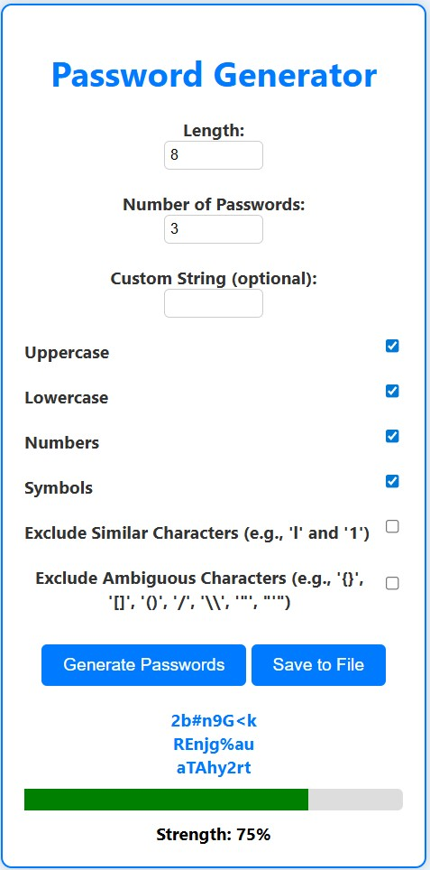
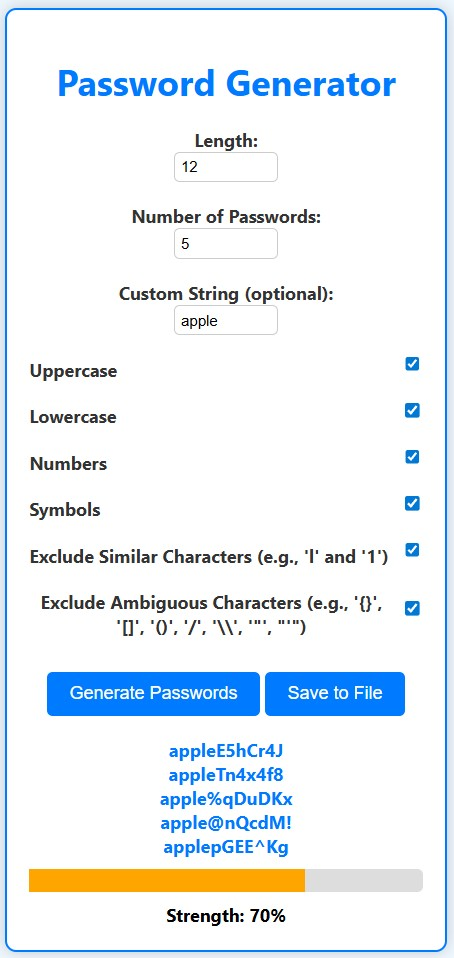
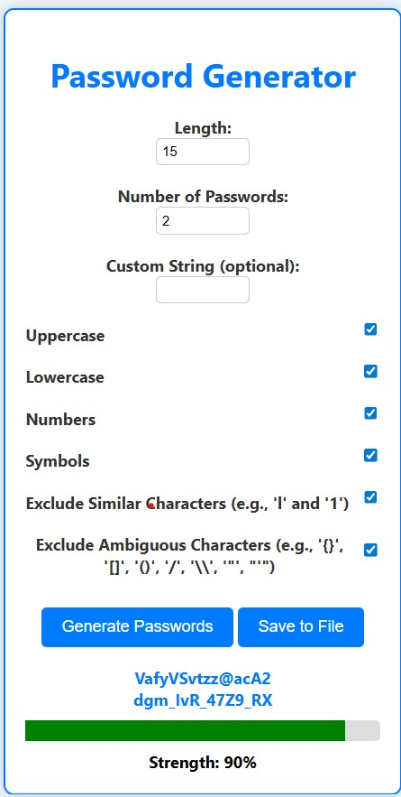

# 🔐**Key Master – Advanced Password Generator**

📌 **Project Overview**

Key Master is a full-stack advanced password generator built using:

✅ Node.js

✅ Express.js

✅ HTML

✅ CSS

✅ JavaScript

It allows users to generate highly secure passwords with advanced customization options.

🎯 **Features**

✔ Custom password length

✔ Generate multiple passwords at once

✔ Uppercase / Lowercase selection

✔ Numbers & Symbols support

✔ Exclude similar characters

✔ Exclude ambiguous characters

✔ Custom string support

✔ Password strength indicator

✔ Saves generated passwords to file (optional feature ready)

🏗 **Project Architecture**
Frontend  →  Backend (Express API)  →  Password Generator Logic

Frontend collects user input

Backend processes request

Server generates secure passwords

Response returned as JSON

⚙ **Installation & Setup**

🔹 1. Clone Repository
git clone <your-github-link>
cd Advanced-Password-Generator

🔹 2. Backend Setup
cd backend
npm install
node server.js

Server runs at:

http://localhost:3000

🔹 3. Frontend

Open:

frontend/index.html

👉 Open directly in browser
OR
👉 Use Live Server in VS Code

🔐 **API Endpoint**
Generate Password
POST /generate

Example Request Body:

{
  "length": 12,
  
  "count": 3,
  
  "includeUppercase": true,
  
  "includeLowercase": true,
  
  "includeNumbers": true,
  
  "includeSymbols": true,
  
  "excludeSimilar": true,
  
  "excludeAmbiguous": false,
  
  "customString": ""
}
🛠 **Technologies Used**

Node.js

Express.js

JavaScript

HTML

CSS

📸 **Screenshots**

🚀 **Future Improvements**

✅ Save passwords to text/CSV file

✅ Export as PDF

✅ Dark / Light mode

✅ Authentication system

✅ Database storage

✅ Deploy to cloud
